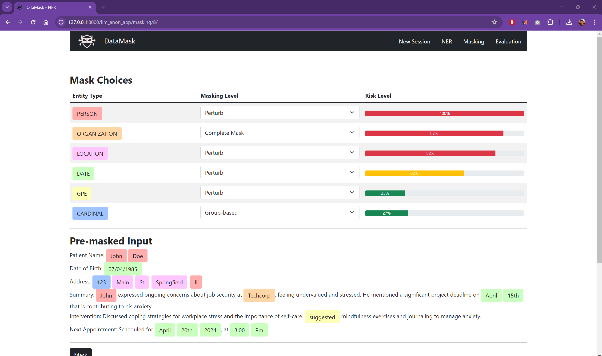

# DataMask
Human-AI Anonymization for Trust





## Inspiration
One of our teammates (Chris) previously started an LLM-based mental health startup last year. They were selling to HR leaders across the globe! The leaders really liked the solution, from Fortune 500 companies to startups, and even the Navy sent their HR team to their doorstep. However, they couldn't reach enterprise-wide deployment despite contracts being signed to experiment with all these companies in a vacuum. This was because of the larger (and evolving) worry of data privacy - every single company worried that their data or the data of their clients would be potentially leaked, used, or abused by the LLMs that the startup was based on. And as we found out, they weren't alone...

The complexity of anonymizing data WHILE preserving context to be useful to LLMs became a huge issue (and idea!) in itself, and that's where this idea came from.

## What It Does
PII Data Masking is a privacy-preserving solution that utilizes locally (cloud) hosted language models to identify and replace sensitive personal information within datasets. By assessing the context and importance of the redacted data, the system generates non-identifiable alternatives that maintain the semantic integrity and analytical value of the original text. This innovative approach ensures data privacy while preserving the usefulness of the dataset for analysis and insights.

## How We Built It
The main goal of our project is to anonymize sensitive data in such a way that the redacted information still retains its usefulness for analysis, without compromising individual privacy.

1. Locally Hosted Language Models
    - You plan to use language models hosted on a local server to scan and process datasets.
    - This ensures enhanced security as the data does not need to be sent to external servers.
    - The initial task of these models is to identify PII accurately within the dataset.
    
2. Context Preservation
    - After identifying the PII, the system assesses the importance of the redacted information within its context.
    - The language model determines why specific information is crucial and how it contributes to the overall meaning of the text.
    - This step is critical to ensure that replacing the PII does not alter the fundamental insights or value derived from the data.
    
3. Synonym and Filler Data Generation
    - Another language model, possibly like Gemini or another capable of generating synonymous expressions, is used to create non-identifiable alternatives that maintain the semantic integrity of the original text.

4. Data Integration
    - The newly generated, anonymized terms or phrases replace the original PII in the dataset.
    - This step requires careful integration to maintain the logical flow and readability of the data, ensuring that the dataset remains useful for analysis.

5. Analysis of Anonymized Data
    - The final dataset, now devoid of PII but still contextually intact, can be safely analyzed using various tools without risking privacy breaches.
    - This allows researchers and analysts to work with the data more freely, without concerns over privacy violations. ## In-Depth Contextualization Explanation I

## Challenges
- Determining who our target customer would be (B2B or B2C)
- Determining how to identify important contextual elements without having the private data touch Gemini
- Getting the LLM to return structured data from an NLP prompt

## Accomplishments 
We integrated a lot of new tools with each other in order to implement a rather complex model framework to solve a major issue that affects just about any company building on top of LLMs. We built a product that has real market value and provides a full application solution to a growing but unmet need.

## What we learned
We learned how to integrate many of the new and developing AI tools together to make a production application.

## What's next for DataMask
- Add customization features designed for different niches beyond therapy, such as law, medicine, and research.
- Deploy everything to the cloud so that we can bring it into production.
- Fully transition from B2C to B2B.

## Development Notes
- After pulling, remember to run:
  - ```pip install -r requirements.txt``` (if libraries have changed)
  - ```python manage.py migrate```
- To run the django server: ```python manage.py runserver```
- To change database (when editing models.py): 
  - ```python manage.py makemigrations```
  - ```python manage.py migrate```
- To clear the database (in case there are conflicts): 
  - ```python manage.py flush```
  - remember to add the super user back: ```python manage.py createsuperuser```
- To collect static files
  - py manage.py collectstatic
